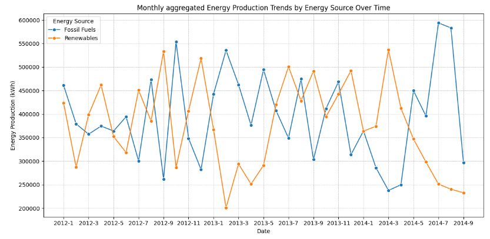

# Energy Market Resilience Metrics: Analyzing Vulnerabilities and Preparing for Disruptions

__Using Python to perform Market Resilience Analysis for an Energy Business. working with popular Python Libraries such as Numpy, Pandas, Matplotlib, and Seaborn for Exploratory Data Analysis.__

## Key steps:
- Rationale for the Project
- Aim of the Project
- Data Description
- Tech Stack
- Project Scope

## Business Introduction:
Energix Enterprise is a prominent player in the energy and Utilities sector, specializing in electricity generation and distribution across various regions. With a diversified energy portfolio encompassing both fossil fuels and renewable sources, the company has been a vital contributor to the energy landscape for over two decades.

Its energy generation and distribution operations span a wide spectrum, from traditional cost and natural gas power plants to cutting edge wind and solar facilities. The company’s commitment to sustainability and environmental responsibility has driven significant investments in renewable energy technologies.

However, recent disruptions in the energy market have raised concerns about the company’s ability to maintain its operations and profitability in the face of unforeseen challenges(circumstances)

## Business Overview/Problem
_Energix Enterprise currently faces several significant challenges:_
1.  **Fluctuations in Energy Demand and Supply:** The energy market experiences fluctuations due to market volatility and evolving consumer behavior. These variations impact the company's operations and profitability.

2.  **Rising Competition from Renewable Energy Providers:** The emergence of renewable energy providers has intensified competition, affecting Energix Enterprise  Energy's market share and pricing strategies.

3.  **Regulatory Changes and Environmental Regulations:** Evolving regulations and environmental mandates have a substantial impact on the company's operations, necessitating compliance measures that add to operational costs.

4. **Aging Infrastructure and Technology Limitations:** Aging infrastructure and outdated technology hinder operational efficiency, risk management, and the company's ability to adapt to market dynamics.

## Rationale for the Project
- __Energy Market Resilience Metrics:__ This part suggests that the study or initiative involves measuring and assessing the resilience of the energy market. Resilience in this context likely means the ability of the energy market to withstand, adapt to, and quickly recover from various challenges or disruptions.
- __Analyzing Vulnerabilities:__ This indicates that the study aims to identify and understand the weaknesses or susceptibilities within the energy market. These vulnerabilities could be related to factors like infrastructure, supply chains, regulatory frameworks, or other aspects that could potentially be exploited or disrupted.
The project is of paramount importance to Energix Enterprise use to the following reasons:

- Enhancing Market Resilience: In the ever-changing energy market, it is imperative to enhance resilience and adaptability to withstand disruptions and maintain operations.
- Identifying Vulnerabilities: Through data analysis, the project aims to identify vulnerabilities and proactively address them, thereby reducing operational risks.
- Maintaining Competitiveness: By optimizing energy production and pricing strategies, the company aims to remain competitive in the face of increasing competition.
- Ensuring Compliance: The project is crucial for ensuring compliance with evolving regulatory requirements and minimizing the company's environmental impact.

## Aim of the Project
- __Resilience Planning:__ Create a comprehensive resilience plan outlining response procedures for various disruptions, ensuring business continuity.
- __Upgrade Technology Infrastructure:__ Identify technology gaps and implement infrastructure upgrades for improved operational efficiency.
- __Optimize Energy Production and Pricing:__ Implement data-driven strategies for optimizing energy production and pricing to maintain profitability.
- __Data Analysis:__ Utilize historical data and market trends to identify vulnerabilities and potential disruption points in the energy market.

## Data Description
- This case study contains 4 datasets, and they are as follows.

### Historical Energy Data: 

- __Date/Time:__ Timestamp of the recorded data.

- __Location/Region:__ The geographical region where energy is generated or distributed.

- __Energy Source:__ Type of energy source (e.g., fossil fuels, renewables).

- __Energy Production (kWh):__ Amount of energy generated in kilowatt-hours.

- __Energy Consumption (kWh):__ Amount of energy consumed in kilowatt-hours.

- __Energy Price (USD/kWh):__ The cost of energy during the period in US dollars per kilowatt-hour.

- __Operational Costs (USD):__ Costs associated with production, maintenance, and distribution in US dollars.

- __Energy Demand (kWh):__ Total energy demand during the period in kilowatt-hours.

### Market Data:

- __Date/Time:__ Timestamp of the recorded market data.

- __Market Price (USD/kWh):__ Price of energy in the market in US dollars per kilowatt-hour.

- __Competitor Data:__ Information about competitors' market strategies (e.g., High, Medium, Low).

- __Market Trends:__ Trends and fluctuations in the energy market (e.g., Upward, Stable, Downward).

✓ Market Demand (kWh): Information about market demand for energy in kilowatt-hours.

### Infrastructure and Maintenance Records:

- __ Date/Time:__  Timestamp of infrastructure and maintenance records.

- __Infrastructure Status:__ Information on the condition of infrastructure (e.g., Good, Fair, Poor).

- __Maintenance Activities:__ Details of maintenance activities (e.g., Routine Maintenance, Repairs, Upgrades).

- __Technology Limitations:__ Information about limitations and challenges posed by existing technology (e.g., None, Low, Moderate, High).

### Regulatory and Compliance Data:

-__Date/Time:__ Timestamp of regulatory changes or compliance activities.

- __Regulatory Changes:__ Details of changes in energy regulations and policies.

- __Compliance Status:__ Information on the company's compliance with regulations (e.g., Compliant, Non-compliant).

- __Compliance Costs (USD):__ Costs associated with ensuring compliance in US dollars.

## Tech Stack
Programming language – Python

### Libraries:

- _Numpy:_ For performing mathematical operations over data

- _Pandas:_ For Data Analysis and Manipulation

- _Matplotlib.pyplot:_ For Data Visualization

- _Seaborn:_ For Data Visualization

- _Jupyter Notebook:_ For documenting and presenting the analysis.

## Project Scope
- Data Collection and Preparation: Gather and clean data from various sources, ensuring data quality using Python.

## Exploratory Data Analysis (EDA):
### Considering Categorical Columns;

- Exploring historical trends, market dynamics, and key variables using Python. Identify patterns, outliers, and anomalies in the data using Python.

- _Optimization Strategies:_ Develop pricing and production optimization strategies based on data analysis using Python. Implement strategies to adapt to changing market conditions using Python.

- _Infrastructure Upgrade:_ Identify technology gaps and implement infrastructure upgrades for improved efficiency using Python. Integrate real-time monitoring and reporting systems using Python.

- _Resilience Planning:_ Create a comprehensive resilience plan in Python, outlining response procedures for various disruptions. Conduct simulations and stress tests using Python to evaluate the effectiveness of the plan.

- _Documentation and Reporting:_ Document the entire project, including data sources, methodologies, and findings using Python.

The Exploratory data analysis considered the following:
- Location/Region and Energy Source from historical_energy_data
- Infrastructure Status, Maintenance Activities, and Technology limitations from infrastructure_data
- Competitor Data and MArket trends from Market_data
- Regulatory Changes and Compliance Status From regulatory data

## ANALYSIS AND INSIGHTS

### A. Energy Demand, Production, and Consumption Over Time:
- We start analyzing the trends in energy demand, and production, with consumption from the 
  historical_energy_dataset
- This will give us insights into fluctuations and potential vulnerabilities in the energy market

#### Observations:
- Energy Production: Energy Produced by Energize Enterprise
- Energy Consumption: Energy Consumed by Customers
- Energy Demand: Energy needed by the market from Energize Enterprise.
- There is more Demand than Production
- There is need to ensure further investigations

### B. Market Price
- To understand the pricing dynamics and its relation to the market trends
- Visualization of the Market Price from the market dataset alongside the Energy Price from the historical energy dataset over time

#### Observation:
From the plot:
- Market Price: Average price based on market forces
- Energy Price : Average price which energix is selling.
- There is no consistency in price as Prices are fluctuating.
- Energix prices are lower compared to conventonal market prices
- Probable reason Energix have a high spike in demand is due to lower prices.
- A need to look more into the analysis

### C. Energy Demand and Energy Price Correlation:
- Checking the influence of energy demand by the current energy price

#### i. Infrastructure Status and Technology Limitations
- Understanding the state of infrastructure over time
- To visualize the frequency of various infrastructure Status and the distribution of Technology Limitations from 
  Infrastructure_data.
- 

#### Observations:
From the plots:
- Infrastructure Is categorized into:
  - _Good:_ Less Frequent almost non-existent
  - _Fair:_ Follows Poor status
  - _Poor:_ Very Prevalent
This indicates reason why energix is unable to meet up with demands probably due to the kind of available infrastructure, hence need for a more proactive maintenance approach to infrastructure:

**While:**
- Technology Limitations is categorized into:
 - _High:_ Data reveals technology limitation is very high followed by
 - _Moderate:_ being average
 - _Low:_ Almost non existent use of technology.
   Suggest hampering operational effectiveness and ability to market properly due to technology limitations.

#### ii. Infrastructure Status Relationship with Technology Limitations:
-To see how they both correlate, to help see a reason behind energix inability to meet up market with demand of products.

### Observations:
From the Heatmap plot the following assumptions are made;
- There is a strong correlation between poor Infrastructure Status and high Technology Limitations as it affect 
   the inability of energix to meet market demand
- Hence for poor Infrastructure Status implies high Technology Limitations
- There is a need for upgrade and total overhaul of energix infrastructure, improve technology uage inorder to increase production to meet market demands.

##### Justifying Assumptions:
- The correlation between poor infrastructure and high technology limitation and the energy production will guide the justification;

#### Observation:
- Correlation coef. of -0.0158 indicates a weak linear relationship.

#### D. Regulatory Changes And Compliance Cost
- To see the impact of regulatory changes on Energix
- TO visualize the frequency of various Regulatory Changes and the distribution of Regulatory Changes And the distribution of Compliance Costs associated with these changes from the regulatory_data

#### Observation:
a. Regulatory Changes, categorized into:
  - New: Higher frequency indicating Energix faces frequent new regulations, contributing factors
  - Amendment: Similar frequency with No Change
  - No Change.
b. Distribution of Compliance Costs:
  - Shows relatively normal distribution

### E. The Impact of Regulatory Changes and Operational Costs on Revenue:
- Visualizing the relationship between regulatory changes and the associated compliance costs, as well as the  
  operational costs to Revenue generated from the company
- Revenue = Energy Consumption * Energy price
- Insights into the financial implications of regulatory changes and operational cost of Energix Enterprise.

#### Observations:
- Operational Costs: Costs associated to the day to day running(operation) of energix enterprise
- Compliance Costs: Costs incurd to ahere to regulatory changes.
- Revenue: Money made from the business.

### F. Competitions from Renewable Energy Providers:

- Competition from other energy providers and impact on Energix Enterprse, Analyzing Energy source from historical dataset
- Visualize the trends in energy production based on the energy source(Fossil Fuels Vs Renewable Energy) over time, To gain insights into how the production from renewable energy has evolved and potentially affected energix market share.

#### Observation:
The graph showcases energy production trends segmented by energy source (Fossil Fuels vs. Renewables) over time:
1. Fossil Fuels: Represents the energy produced from conventional sources.
2. Renewables: Represents the energy produced from renewable sources.
 
From the graph, we observe:
1. There are fluctuations in energy production from both fossil fuels and renewables.
2. Energy production from renewables has seen significant growth over certain periods, indicating a shift towards sustainable energy sources.
3. There are periods where the production from renewables surpasses that of fossil fuels. This could be indicative of the rising competition from renewable energy providers, potentially impacting Energix Enterprise's market share.
4. Understanding these trends is crucial for Energix Enterprise to adapt its strategies and maintain competitiveness in the evolving energy market.

### General Insights:
1. __Dynamic Energy Landscape:__ Energix Enterprise experiences marked variances in energy production, consumption, and demand patterns. There are distinct periods where the demand overshadows production, highlighting potential areas of concern in market stability and supply consistency.

2. __Pricing Volatility:__ Energix's energy pricing exhibits variability in alignment with broader market price trends. Notably, the energy price remains uncorrelated with energy demand, presenting potential challenges in sales predictability and revenue forecasting.

3. __Infrastructure & Technology Concerns:__ A significant portion of the company's infrastructure is categorized as 'Poor'. Coupled with pronounced technology limitations, there's a compelling case for comprehensive infrastructure rejuvenation. Preliminary analysis suggests that periods of 'Poor' infrastructure status and 'High' technology constraints may correlate with diminished energy production.

4. __Regulatory & Financial Implications:__ Energix is continually navigating a changing regulatory landscape, with new mandates and modifications to existing ones. The financial ramifications, especially in terms of compliance costs and operational expenditures, are substantial. A juxtaposition of these costs with the firm's current revenue trajectory indicates a pressing profitability challenge.

5. __Emergence of Renewables:__ The energy market is witnessing a paradigm shift with renewables gaining prominence. Data trends suggest instances where renewable energy production has eclipsed that of fossil fuels. For Energix, this underscores the dual challenges of evolving competition and potential erosion of market share.

### Resilience Planning and Recommendations

1. **Balanced Energy Portfolio**: Energix Enterprise should consider diversifying its energy production portfolio to mitigate the risks associated with fluctuations in demand and production. A balanced mix of renewable and non-renewable sources can help stabilize the energy supply and meet demand more consistently.

2. **Dynamic Pricing Model**: Given that energy price doesn't correlate with energy demand, Energix should consider implementing a dynamic pricing model. This model can adjust prices based on demand, production costs, and other market factors. Such a model can help in improving sales during high-demand periods and maintaining profitability during low-demand times.

3. **Infrastructure Revamp**: With most of the company's infrastructure in 'Poor' status and high technology limitations, Energix should prioritize investments in infrastructure upgrades. Modernizing infrastructure can lead to increased production efficiency, reduced downtimes, and potentially higher energy output.

4. **Regulatory Compliance Fund and Operational Cost**: Given the periodic introduction of new regulations and the associated compliance costs and also operational cost. Energix should establish a dedicated fund or reserve to address these unforeseen expenses. This approach can help in budgeting and ensuring that costs don't significantly impact the company's bottom line.

5. **Embrace Renewables**: The trend towards renewable energy is evident. Energix should consider increasing its investments in renewable energy technologies and infrastructure. This not only aligns with global sustainability goals but also positions the company to better compete in an evolving energy market.

6. **Cost Management & Revenue Generation**: Considering the operational and compliance costs are impacting profitability, Energix should undertake a thorough review of its operations to identify cost-saving opportunities. Additionally, exploring alternative revenue streams, such as energy storage solutions or consultancy services, can further bolster the company's financial position.

7. **Stakeholder Engagement**: Engage with regulatory bodies proactively to stay ahead of potential regulatory changes. This proactive approach can help in better preparation and can also influence regulations in a manner favorable to Energix.

8. **Market Research & Consumer Insights**: Conduct regular market research to understand consumer preferences, especially concerning renewable energy. This can guide Energix's strategy in terms of energy source diversification and pricing.

:                                            

In conclusion, while Energix faces challenges in terms of fluctuating demand, aging infrastructure, and increasing competition from renewables, there are clear strategic paths available. By modernizing infrastructure, diversifying energy sources, and adopting a dynamic pricing model, Energix can position itself for sustained growth and profitability in the future energy market.

          

Providing actionable insights and recommendations for Energix Energy Corporation using Python.
